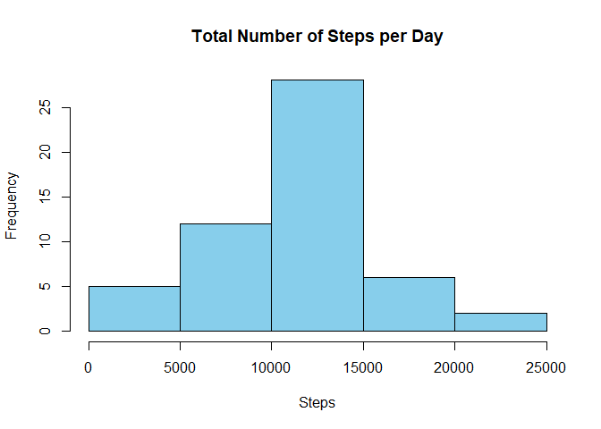
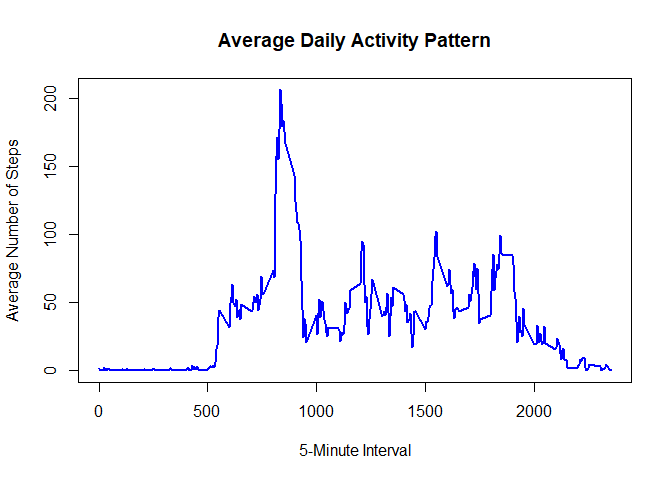
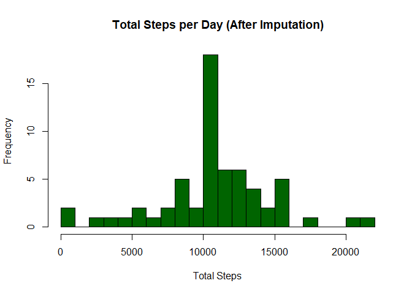
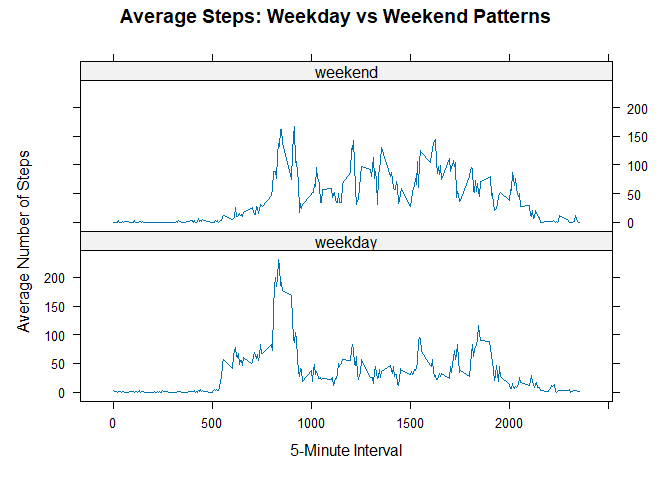

## Loading and preprocessing the data


```r
library(dplyr)
```

```
## 
## Attaching package: 'dplyr'
```

```
## The following objects are masked from 'package:stats':
## 
##     filter, lag
```

```
## The following objects are masked from 'package:base':
## 
##     intersect, setdiff, setequal, union
```

```r
# Unzip and read the CSV file
unzip("activity.zip")
activity <- read.csv("activity.csv")

# Convert 'date' column to Date type
activity$date <- as.Date(activity$date)

# Preview the dataset
head(activity)
```

```
##   steps       date interval
## 1    NA 2012-10-01        0
## 2    NA 2012-10-01        5
## 3    NA 2012-10-01       10
## 4    NA 2012-10-01       15
## 5    NA 2012-10-01       20
## 6    NA 2012-10-01       25
```

## What is mean total number of steps taken per day?


```r
# Summarize total steps taken per day, ignoring NA values
steps_per_day <- activity %>%
  filter(!is.na(steps)) %>%
  group_by(date) %>%
  summarise(total_steps = sum(steps))

# Plot histogram
hist(steps_per_day$total_steps,
     main = "Total Number of Steps per Day",
     xlab = "Steps",
     col = "skyblue",
     border = "black")
```

<!-- -->

```r
# Calculate mean and median
mean_steps <- mean(steps_per_day$total_steps)
median_steps <- median(steps_per_day$total_steps)

# Print results
mean_steps
```

```
## [1] 10766.19
```

```r
median_steps
```

```
## [1] 10765
```

## What is the average daily activity pattern?


```r
# Average steps per interval across all days
avg_interval_steps <- activity %>%
  filter(!is.na(steps)) %>%
  group_by(interval) %>%
  summarise(mean_steps = mean(steps))

# Line plot
plot(avg_interval_steps$interval, avg_interval_steps$mean_steps, 
     type = "l",
     col = "blue",
     lwd = 2,
     xlab = "5-Minute Interval",
     ylab = "Average Number of Steps",
     main = "Average Daily Activity Pattern")
```

<!-- -->

```r
# Interval with max average steps
max_interval <- avg_interval_steps[which.max(avg_interval_steps$mean_steps), ]
max_interval
```

```
## # A tibble: 1 × 2
##   interval mean_steps
##      <int>      <dbl>
## 1      835       206.
```

## Imputing missing values


```r
# Count total missing values
na_total <- sum(is.na(activity$steps))
na_total
```

```
## [1] 2304
```

```r
# Fill NA with mean for that interval
interval_means <- activity %>%
  group_by(interval) %>%
  summarise(mean_steps = mean(steps, na.rm = TRUE))

activity_filled <- merge(activity, interval_means, by = "interval")
activity_filled$steps <- ifelse(is.na(activity_filled$steps),
                                activity_filled$mean_steps,
                                activity_filled$steps)

# Clean up columns
activity_filled <- activity_filled %>%
  select(steps, date, interval)

# Confirm no more NAs
sum(is.na(activity_filled$steps))
```

```
## [1] 0
```

```r
# Histogram of total steps after filling
total_steps_filled <- activity_filled %>%
  group_by(date) %>%
  summarise(total_steps = sum(steps))

hist(total_steps_filled$total_steps,
     col = "darkgreen",
     main = "Total Steps per Day (After Imputation)",
     xlab = "Total Steps",
     breaks = 20)
```

<!-- -->

```r
# New mean and median
mean_filled <- mean(total_steps_filled$total_steps)
median_filled <- median(total_steps_filled$total_steps)

mean_filled
```

```
## [1] 10766.19
```

```r
median_filled
```

```
## [1] 10766.19
```

## Are there differences in activity patterns between weekdays and weekends?


```r
# Add weekday/weekend label
activity_filled$day_type <- ifelse(weekdays(activity_filled$date) %in% 
                                   c("Saturday", "Sunday"), "weekend", "weekday")
activity_filled$day_type <- factor(activity_filled$day_type, levels = c("weekday", "weekend"))

# Average steps per interval by day type
avg_by_daytype <- activity_filled %>%
  group_by(interval, day_type) %>%
  summarise(avg_steps = mean(steps), .groups = "drop")

# Load lattice and plot
library(lattice)
xyplot(avg_steps ~ interval | day_type, data = avg_by_daytype, 
       type = "l",
       layout = c(1, 2),
       xlab = "5-Minute Interval",
       ylab = "Average Number of Steps",
       main = "Average Steps: Weekday vs Weekend Patterns")
```

<!-- -->
